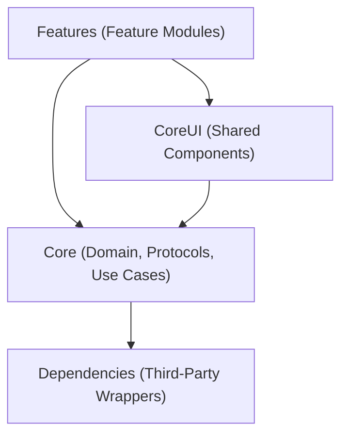

# Current Architecture — Factoria-Swf (Swift/iOS)

## Overview

The Swift/iOS factory targets native iOS applications built with Swift 5.10+, SwiftUI, and a modular SPM-based architecture following MVVM with Coordinator pattern.

## Technology Stack (Golden Path)

| Layer | Technology |
|-------|-----------|
| Language | Swift 5.10+ |
| UI Framework | SwiftUI (iOS 15+) |
| Architecture | MVVM + Coordinator pattern |
| Module System | Swift Package Manager (SPM) |
| Dependency Injection | Factory |
| Networking | Alamofire |
| Local Persistence | Realm |
| Authentication | MSAL (Azure B2C) |
| Analytics & Crash | Firebase Analytics, Crashlytics |
| Remote Config | Firebase Remote Config |
| Reactive | Combine |
| Testing | XCTest, XCTestExpectation |

## Module Dependency Graph

**Strict dependency direction:** Dependencies → Core → CoreUI → Features

- Feature modules **NEVER** import other Feature modules
- Core modules **NEVER** import Feature modules
- CoreUI provides shared SwiftUI components and the design system
- Dependencies wraps third-party SDKs behind protocols

## Module Structure

### Dependencies Module
- Alamofire session configuration and interceptors
- Realm configuration and migration manager
- MSAL authentication provider
- Firebase wrappers (Analytics, Crashlytics, Remote Config)
- All wrapped behind protocol abstractions

### Core Module
- Domain models (Spanish naming: `Usuario`, `Sesion`, `Resultado`)
- Use case protocols and implementations
- Repository protocols (data access contracts)
- Combine publisher extensions
- Error types and domain exceptions

### CoreUI Module
- Shared SwiftUI components (buttons, cards, inputs)
- Design system (colors, typography, spacing)
- BFF component rendering via `FabricaDeComponentes`
- Theming and appearance management

### Feature Modules
Each feature is an independent SPM module containing:
- **ViewModel** — `@MainActor`, `@Published` state, Combine subscriptions
- **View** — SwiftUI view bound to ViewModel
- **Coordinator** — Navigation flow management
- **Proveedor** — Factory DI Container registration

## Key Patterns

### MVVM
- ViewModels own business logic and state
- Views observe ViewModel via `@StateObject` / `@ObservedObject`
- No business logic in Views
- No SwiftUI imports in ViewModels (Combine only)

### Coordinator
- Each feature has a Coordinator managing its navigation
- Routes defined via `Hashable` enums
- Deep link support through Coordinator routing
- Navigation decoupled from Views and ViewModels

### Factory DI
- All dependencies registered in Factory `Container` extensions
- `@Injected` for required dependencies in ViewModels
- `@LazyInjected` for optional/deferred dependencies
- Protocols exposed in Container, never concrete types
- `Proveedor` files per feature handle DI registration

### BFF (Backend for Frontend)
- `FabricaDeComponentes` renders UI from server-driven config
- Each component conforms to `ComponenteUI` protocol
- Dynamic UI composition based on API response

### Combine Reactive
- Network responses as `AnyPublisher`
- ViewModel state via `@Published` + `AnyCancellable`
- Subscription management in `Set<AnyCancellable>`

## Naming Conventions
- Domain types in Spanish: `Usuario`, `Coordinador`, `Proveedor`
- Protocols suffixed with purpose: `RepositorioDeUsuarios`, `ServicioDeAutenticacion`
- ViewModels: `[Feature]VistaModelo` or `[Feature]ViewModel`
- Views: `[Feature]Vista` or `[Feature]View`
- Test classes: `[Component]Tests`
