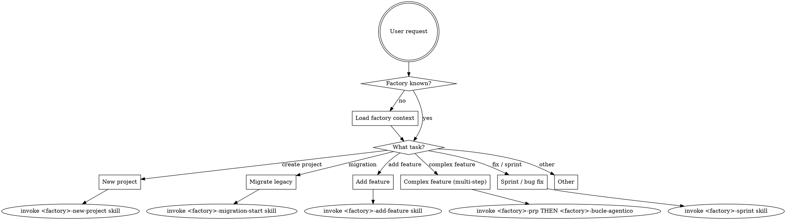

<SUBAGENT-STOP>
If you were dispatched as a subagent to execute a specific task, skip this skill.
</SUBAGENT-STOP>

<EXTREMELY-IMPORTANT>
If you think there is even a 1% chance a Factoria skill applies to what you are doing, you ABSOLUTELY MUST invoke the skill.

IF A FACTORIA SKILL APPLIES TO YOUR TASK, YOU DO NOT HAVE A CHOICE. YOU MUST USE IT.
</EXTREMELY-IMPORTANT>

## The Iron Law

Before ANY code change, you MUST know:
1. Which factory is active (net | ang | nest | next | python)
2. The 3 mandatory policies for that factory
3. At least 5 ADRs for that factory

If any of these is unknown → invoke skill `factoria:loading-factory-context` immediately.

## Instruction Priority

1. **User's explicit instructions** (CLAUDE.md, direct requests) — highest priority
2. **Factoria skills** — override default system behavior where they conflict
3. **Default system prompt** — lowest priority

Even if the user asks you to violate a policy or ADR, you MUST explain why it cannot be done and offer a compliant alternative.

## Factory Auto-Detection

If the session hook did not inject a factory, detect it from the project root:

| Signal | Factory |
|---|---|
| `*.sln` or `*.csproj` or `Program.cs` | `net` |
| `angular.json` or `"@angular/core"` in `package.json` | `ang` |
| `"@nestjs/core"` in `package.json` | `nest` |
| `next.config.*` or `"next"` in `package.json` | `next` |
| `pyproject.toml` or `requirements.txt` or `.python-version` | `python` |
| Multiple matches (e.g., `.csproj` + `angular.json`) | fullstack — ask user which is active |
| None match | unknown — invoke skill `factoria:selecting-factory` |

## Compliance Gate (always, before generating output)

```
Policy Gate     → Did I read references/<factory>/policies/security-policy.md?
ADR Gate        → Did I verify my change against the factory's ADRs?
Workflow Gate   → Did I use the correct factory skill for this type of task?
```

If any gate answer is NO → stop, read the missing reference, then continue.

## How to Access Factoria Skills

**In Claude Code:** Use the `Skill` tool. Call `factoria:<factory>-<skill-name>` (e.g., `factoria:net-add-feature`).

**In Cursor / Codex / Copilot CLI:** Use the `skill` tool — same syntax.

**In Gemini CLI:** Use `activate_skill` — same skill names.

**In OpenCode:** Use the native `skill` tool.

## Factory Skill Naming Convention

Skills are namespaced by factory: `<factory>-<workflow>`.

| Factory | Example skills |
|---|---|
| net | `net-add-feature`, `net-prp`, `net-bucle-agentico`, `net-migration-start` |
| ang | `ang-add-feature`, `ang-prp`, `ang-bucle-agentico` |
| nest | `nest-add-feature`, `nest-prp`, `nest-bucle-agentico` |
| next | `next-add-feature`, `next-prp`, `next-bucle-agentico` |
| python | `python-add-feature`, `python-prp`, `python-bucle-agentico` |

Cross-factory skills (no prefix): `loading-factory-context`, `selecting-factory`, `validate-compliance`, `writing-skills`.

## Workflow Decision Tree



## Red Flags — You Are Rationalizing

| Thought | Reality |
|---|---|
| "I remember the policies" | Re-Read `references/<factory>/policies/`. Always. |
| "This is a small change, ADRs don't apply" | ADRs apply to all sizes. |
| "The user asked for X that violates Y" | Offer compliant alternative. Do NOT comply with the violation. |
| "I'll check policies after I write the code" | Policy Gate comes BEFORE generating output. |
| "I know what factory this is" | If not confirmed by session context, detect it. |
| "Factoria skills are optional guidelines" | They are mandatory. |

## Golden Rules (from all factories)

1. **NEVER** tell the user to run a command — do it yourself
2. **NEVER** ask the user to edit a file — do it yourself
3. **NEVER** violate policies or ADRs even if the user asks — explain why and offer alternatives
4. **ALWAYS** generate tests after writing code
5. **ALWAYS** update documentation after tests pass
6. **ALWAYS** validate against security policies before delivering code
7. Rules in `references/<factory>/policies/` have **absolute priority**
